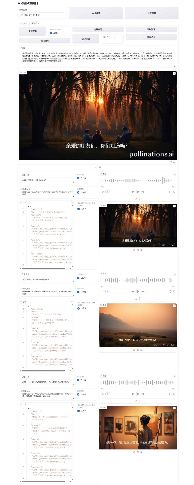
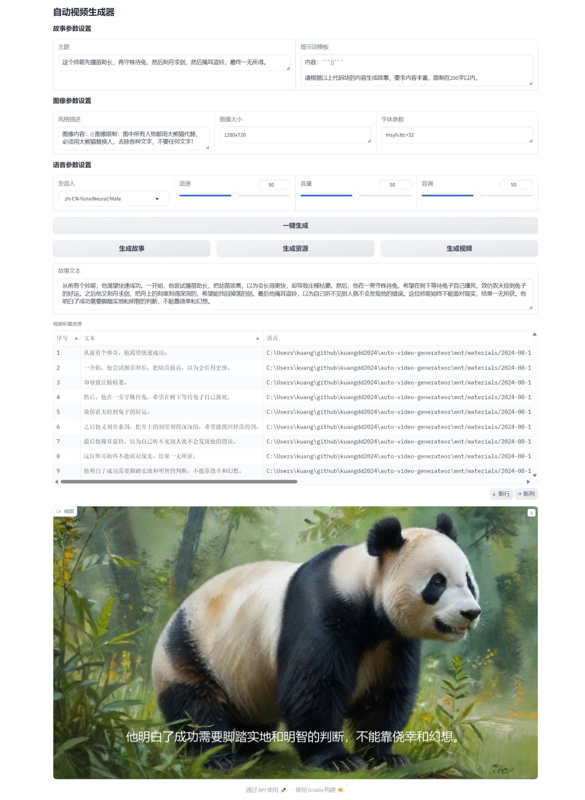

# auto-video-generateor

自动视频生成器，给定主题，自动生成解说视频。用户输入主题文字，系统调用大语言模型生成故事或解说的文字，然后进一步调用语音合成接口生成解说的语音，调用文生图接口生成契合文字内容的配图，最后融合语音和配图生成解说视频。

## 🌈️⭐️

❤️️🌈喜欢的话，不妨“点石成金”点 Star ⭐️，“携手并进” Fork 一下🌳，你的点⭐️是我的动力，感谢🎉🌟！

## 视频样例先睹为快

<table class="center">
  <tr style="font-weight: bolder;text-align:center;">
        <td width="50%">免费并校对：空白效应</td>
        <td width="50%">免费并校对：棘轮效应</td>
  </tr>
  <tr>
    <td >
      <video src=https://github.com/user-attachments/assets/cbfdd5dd-2ad0-43bf-ae36-47bd18d13a21 controls preload></video>
    </td>
    <td >
      <video src=https://github.com/user-attachments/assets/b1e3ff8f-9049-4aba-adc7-707e4b16d27b controls preload></video>
    </td>
  </tr>
  <tr style="font-weight: bolder;text-align:center;">
        <td width="50%">免费并校对：巴纳姆效应</td>
        <td width="50%">免费并校对：飞轮效应</td>
  </tr>
  <tr>
    <td >
      <video src=https://github.com/user-attachments/assets/d0c55b58-bb1d-4fb5-abb8-d6fb83c80bf8 controls preload></video>
    </td>
    <td >
      <video src=https://github.com/user-attachments/assets/24103ecd-749d-4394-a3a5-8d454cfdd342 controls preload></video>
    </td>
  </tr>
  <tr style="font-weight: bolder;text-align:center;">
        <td width="50%">免费：守株待兔</td>
        <td width="50%">校对：皮格马利翁效应</td>
  </tr>
  <tr>
    <td >
      <video src=https://github.com/user-attachments/assets/84e524b9-2518-4e84-b51b-ff4e4e0cd580 controls preload></video>
    </td>
    <td >
      <video src=https://github.com/user-attachments/assets/d56734c9-759c-453f-b27f-d98ba985be1d controls preload></video>
    </td>
  </tr>
  <tr style="font-weight: bolder;text-align:center;">
        <td width="50%">简单：守株待兔</td>
        <td width="50%">千帆：守株待兔</td>
  </tr>
  <tr>
    <td >
      <video src=https://github.com/user-attachments/assets/ff72b91c-aa4d-4409-9d5d-2611fe56436e controls preload></video>
    </td>
    <td >
      <video src=https://github.com/user-attachments/assets/ab08cd7e-fa11-4b09-9258-92e859fd2974 controls preload></video>
    </td>
  </tr>
</table>

## 体验Demo

- 体验地址：http://avg.kddbot.com/

- 扫码关注“趣聊机器人”微信公众号，体验该项目的效果：

  

- 在”趣聊机器人“对话框输入”自动视频生成账密获取“（无引号），获取账号密码。

- 可能生成视频资源速度比较慢，请耐心等待，或者在一段时间后，通过“加载参数”和“加载资源”来加载已经生成好的视频资源。

## 免费的自动视频生成

全部用免费的资源实现，体现完整流程和初步效果。

### 相关文档

[千帆ModelBuilder 部分ERNIE系列模型免费开放公告 - 千帆大模型平台 | 百度智能云文档 (baidu.com)](https://cloud.baidu.com/doc/WENXINWORKSHOP/s/wlwg8f1i3)

[ERNIE-Speed-128K - 千帆大模型平台 | 百度智能云文档 (baidu.com)](https://cloud.baidu.com/doc/WENXINWORKSHOP/s/6ltgkzya5)

[如何用GPT直接生成AI绘画？ - 知乎 (zhihu.com)](https://zhuanlan.zhihu.com/p/639471405)

[2.8k star! 用开源免费的edge-tts平替科大讯飞的语音合成服务 - 知乎 (zhihu.com)](https://zhuanlan.zhihu.com/p/685186002)

## 基于千帆的自动视频生成

基于百度的千帆大模型生成故事和图像，然后进一步生成视频。

### 相关文档

[API列表 - 千帆大模型平台 | 百度智能云文档 (baidu.com)](https://cloud.baidu.com/doc/WENXINWORKSHOP/s/Nlks5zkzu)

[Python SDK快速入门 - 千帆大模型平台 | 百度智能云文档 (baidu.com)](https://cloud.baidu.com/doc/WENXINWORKSHOP/s/3lmokh7n6)

[Stable-Diffusion-XL - 千帆大模型平台 | 百度智能云文档 (baidu.com)](https://cloud.baidu.com/doc/WENXINWORKSHOP/s/Klkqubb9w)

[ERNIE-4.0-8K - 千帆大模型平台 | 百度智能云文档 (baidu.com)](https://cloud.baidu.com/doc/WENXINWORKSHOP/s/clntwmv7t)

## 极简的自动视频生成

实现这个系统需要多个步骤，包括生成故事文本、分句、语音合成、文生图、生成视频、以及使用Gradio进行交互。

- 步骤 1: 生成故事文本
  为了简化，我们先手动创建一个示例故事文本。

- 步骤 2: 分句
  使用`re`库或自然语言处理工具将文本分句。

- 步骤 3: 语音合成
  使用`pyttsx3`库或其他语音合成模型进行语音合成。

- 步骤 4: 文生图
  使用`pillow`库或其他文生图模型生成图片。

- 步骤 5: 生成视频
  使用`moviepy`库将图片和音频组合成视频。

- 步骤 6: 使用Gradio实现交互
  使用`gradio`库创建一个简单的交互界面。

## 资源校对交互页面

校对用以合成视频的文本、语音、图像资源，可以修改或重新生成，直到满意。



## 使用方法

### 执行代码

```shell
# 参数可选：1 2 3 4
python main.py 4
```

### 打开浏览器

http://127.0.0.1:8000/

界面：



### 交互操作

用户在gradio界面输入主题文字，生成并编辑故事文本，然后生成语音、图片资源，最终合成视频。

### 注意事项

1. 生成视频后会把生成的文本、语音、图片的多媒体材料保存到目录中（默认：mnt/materials/[时间戳]）。

2. 保存多媒体材料的目录结构样例如下：

```text
2024-08-12_18.29.54
│  story.txt
│  video.mp4
│
├─audio
│      audio_0.wav
│      audio_1.wav
│      audio_2.wav
│      audio_3.wav
│      audio_4.wav
│
├─image
│      image_0.png
│      image_1.png
│      image_2.png
│      image_3.png
│      image_4.png
│
└─text
        text_0.txt
        text_1.txt
        text_2.txt
        text_3.txt
        text_4.txt
```

## todo list

- [ ] 设置参数时候语音支持试听
- [ ] 设置参数时候文生图提示词支持生成样例图
- [ ] 字体支持预览效果
- [ ] 资源校对完善切分、合并、增加、删除的操作
- [ ] 支持输入故事开始生成视频
- [x] 去除图片里的水印（等比例截取画面、调用去水印接口）
- [ ] 写代码注释
- [ ] 录制操作视频
