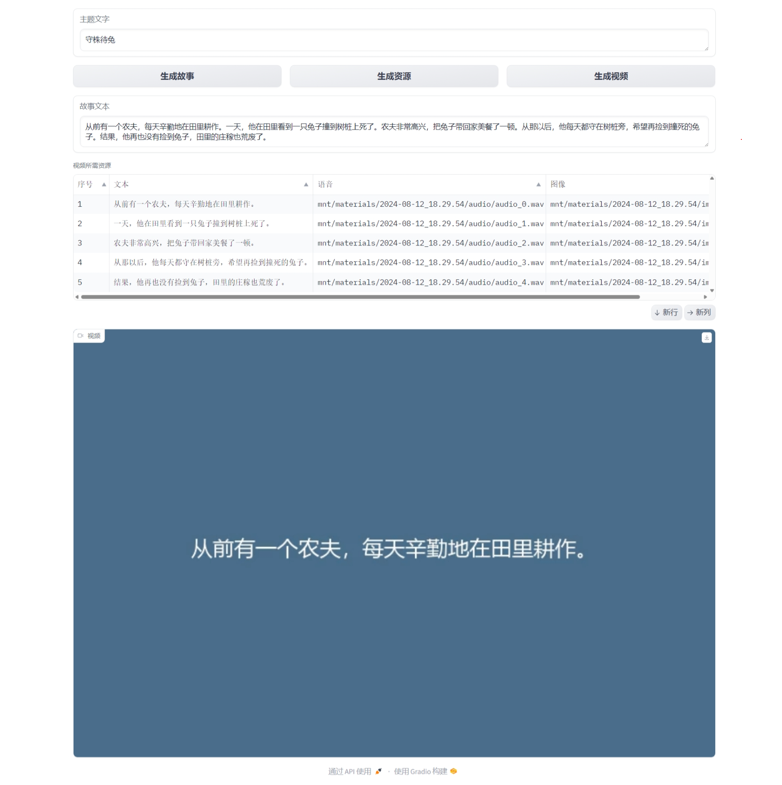

# auto-video-generateor
自动视频生成器，给定主题，自动生成解说视频。用户输入主题文字，系统调用大语言模型生成故事或解说的文字，然后进一步调用语音合成接口生成解说的语音，调用文生图接口生成契合文字内容的配图，最后融合语音和配图生成解说视频。

## 实现方案
实现这个系统需要多个步骤，包括生成故事文本、分句、语音合成、文生图、生成视频、以及使用Gradio进行交互。

### 步骤 1: 生成故事文本
为了简化，我们先手动创建一个示例故事文本。

### 步骤 2: 分句
使用`re`库或自然语言处理工具将文本分句。

### 步骤 3: 语音合成
使用`pyttsx3`库或其他语音合成模型进行语音合成。

### 步骤 4: 文生图
使用`pillow`库或其他文生图模型生成图片。

### 步骤 5: 生成视频
使用`moviepy`库将图片和音频组合成视频。

### 步骤 6: 使用Gradio实现交互
使用`gradio`库创建一个简单的交互界面。

## 使用方法

### 执行代码
```shell
python simple_webui.py
```

### 打开浏览器

http://127.0.0.1:8000/

界面：



### 交互操作

用户在gradio界面输入主题文字，生成并编辑故事文本，然后生成语音、图片资源，最终合成视频。

### 注意事项

1. 生成视频后会把生成的文本、语音、图片的多媒体材料保存到目录中（默认：mnt/materials/[时间戳]）。

2. 保存多媒体材料的目录结构样例如下：

```text
2024-08-12_18.29.54
│  story.txt
│  video.mp4
│
├─audio
│      audio_0.wav
│      audio_1.wav
│      audio_2.wav
│      audio_3.wav
│      audio_4.wav
│
├─image
│      image_0.png
│      image_1.png
│      image_2.png
│      image_3.png
│      image_4.png
│
└─text
        text_0.txt
        text_1.txt
        text_2.txt
        text_3.txt
        text_4.txt
```

3. 生成的样例视频如下：

<table>
<thead>
<tr>
<th align="center"><g-emoji class="g-emoji" alias="arrow_forward">▶️</g-emoji>守株待兔</th>
</tr>
</thead>
<tbody>
<tr>
<td align="center"><video src="https://github.com/user-attachments/assets/ff72b91c-aa4d-4409-9d5d-2611fe56436e"></video></td>
</tr>
</tbody>
</table>
